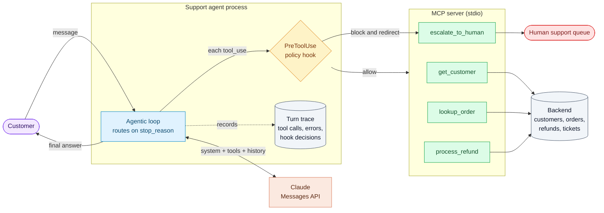
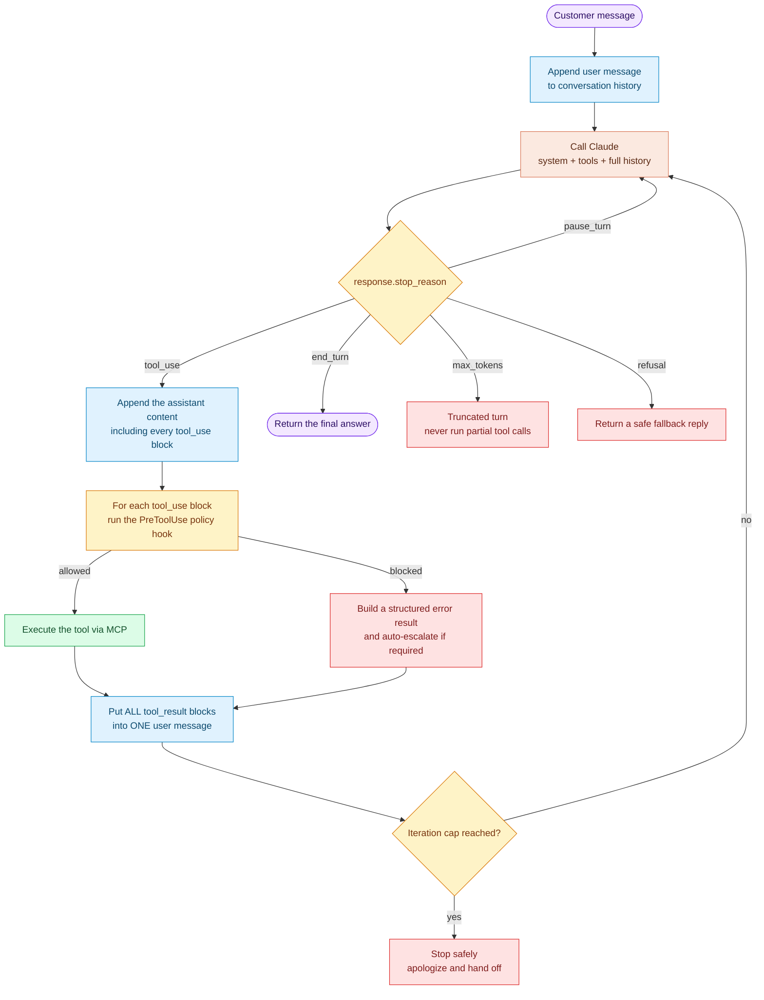
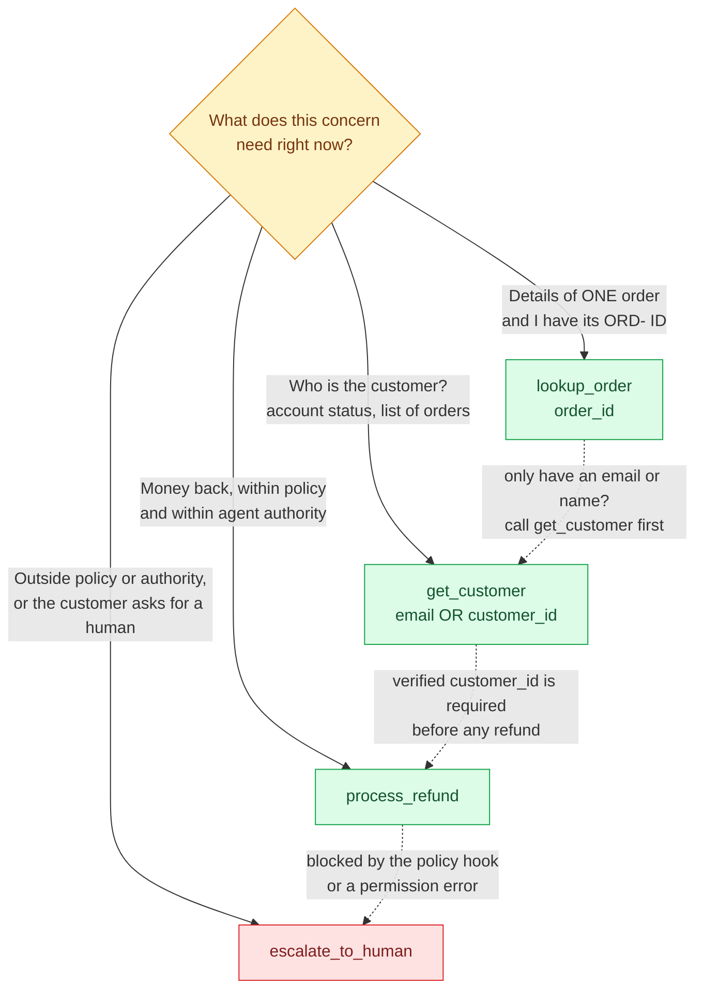
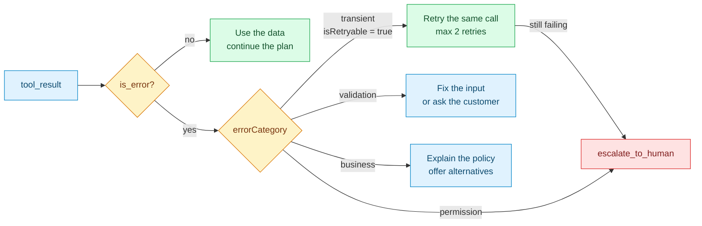
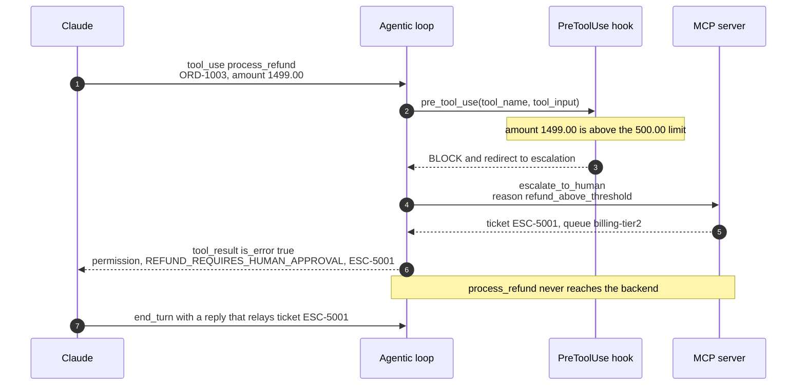
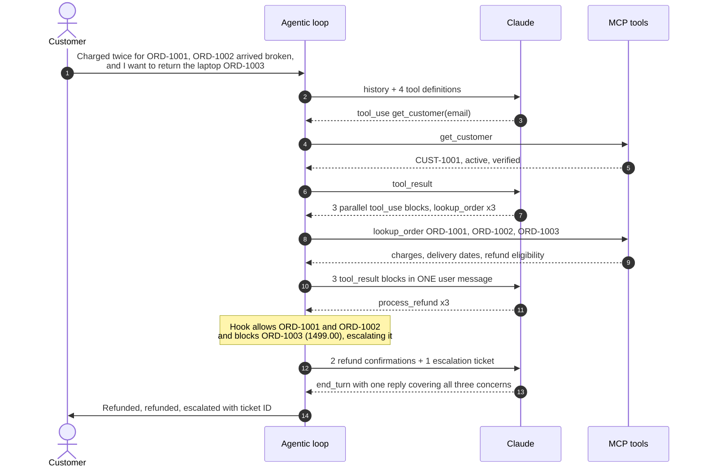

# Multi-Tool Customer Support Agent

A Claude-powered support agent that resolves returns, billing disputes, and account issues on first
contact, and knows when to hand a case to a human.

It reaches backend systems through a custom **MCP server**, runs its own **`stop_reason`-driven
agentic loop**, gets back **structured tool errors** it can reason about, and has business rules
enforced by a **programmatic hook** that redirects risky actions into an escalation workflow.

> Project brief (objective and tasks): [PROJECT.md](PROJECT.md)

---

## Contents

- [Design at a glance](#design-at-a-glance)
- [1. Architecture](#1-architecture)
- [2. The agentic loop](#2-the-agentic-loop)
- [3. Tool design (MCP)](#3-tool-design-mcp)
- [4. Structured error responses](#4-structured-error-responses)
- [5. Policy hook: enforce the refund limit and redirect to escalation](#5-policy-hook-enforce-the-refund-limit-and-redirect-to-escalation)
- [6. Multi-concern requests](#6-multi-concern-requests)
- [7. Two runtimes, one toolset](#7-two-runtimes-one-toolset)
- [Getting started](#getting-started)
- [Usage](#usage)
- [Testing and evaluation](#testing-and-evaluation)
- [Running the scenarios yourself: SCENARIOS.md](SCENARIOS.md)
- [Demo data](#demo-data)
- [How each requirement is met](#how-each-requirement-is-met)
- [Design decisions and trade-offs](#design-decisions-and-trade-offs)
- [Project structure](#project-structure)

---

## Design at a glance

| Goal | How the design meets it |
|---|---|
| **80%+ first-contact resolution** | The four tools cover the whole *identify → inspect → act* path. The system prompt tells Claude to split a message into separate concerns, resolve each one, and answer everything in one reply. |
| **Know when to escalate** | `escalate_to_human` takes a structured handoff (summary, actions taken, recommended action), so the human doesn't need the transcript. Permission errors, explicit requests for a human, and refunds above the limit all route there. |
| **Reliable tool selection** | Each tool description says when to use it, when *not* to, what inputs it expects, and its limits. The two lookup tools, which overlap, point to each other explicitly. |
| **Recoverable failures** | Every tool error carries `errorCategory`, `isRetryable`, and a human-readable `description`. The agent retries transient errors, fixes validation errors, explains business errors, and escalates permission errors. |
| **Guardrails that always hold** | Refund limits and identity checks live in a code hook that runs **before** the tool executes. The model can't talk its way past them. |

---

## 1. Architecture



| Component | Responsibility | Module |
|---|---|---|
| **Agentic loop** | Sends the conversation to Claude and routes on `stop_reason`. Runs tools, returns results, and stops on `end_turn`. | `agent.py` |
| **Policy hook** | Intercepts every tool call before it runs. Blocks calls that break business rules and, where needed, opens an escalation ticket automatically. | `policy.py` |
| **MCP server** | Exposes the four tools with detailed descriptions, JSON schemas, and MCP tool annotations over stdio. It works with any MCP client, including Claude Desktop and Claude Code. | `mcp_server.py` |
| **Tool layer** | The single source of truth for tool names, descriptions, and schemas, plus dispatch and structured error conversion. | `tools.py`, `errors.py` |
| **Backend** | An in-memory stand-in for the order, billing, and ticketing systems. Seeded with demo customers, and able to inject faults for testing. | `backend.py` |
| **System prompt** | The working method (decompose, verify, investigate, act, reply once), refund policy, error-handling rules, and escalation criteria. | `prompts.py` |
| **Agent SDK runtime** | The same tools and policy on the Claude Agent SDK, with the policy running as a `PreToolUse` hook. | `sdk_agent.py` |
| **CLI and scenarios** | Interactive chat, one-shot questions, and a live scenario suite that scores the agent. | `cli.py`, `scenarios.py` |

---

## 2. The agentic loop

The loop decides what happens next from the API's `stop_reason`, never from the text of the reply.



| `stop_reason` | Meaning | Loop behaviour |
|---|---|---|
| `tool_use` | Claude wants one or more tools run | Run every requested tool (through the hook), send all results back in a single user message, and call Claude again |
| `end_turn` | Claude has finished its answer | Leave the loop and return the text to the customer |
| `pause_turn` | The server paused a long turn | Send the conversation back as-is so Claude can resume |
| `max_tokens` | Output was cut off | Don't run tool calls that may be incomplete. Close them out with error results so the history stays valid. |
| `refusal` | The safety classifier declined | Return a safe reply. Server-side fallbacks are enabled, so this should be rare. |

Loop rules:

1. **Append the full `response.content`**, not only the text. The `tool_use` blocks (and any thinking
   blocks) must stay in the history.
2. **Every `tool_use` gets exactly one `tool_result`** with the matching `tool_use_id`, and that
   includes blocked calls.
3. **Put all tool results for a turn in one user message.** Splitting them teaches the model to stop
   calling tools in parallel.
4. **Cap the iterations.** The cap is a safety net, not the normal way the loop ends.

---

## 3. Tool design (MCP)

| Tool | Purpose | Input | Returns | Side effects |
|---|---|---|---|---|
| `get_customer` | Identify and verify the customer. Returns account status and an **order summary** (ID, date, status, total), nothing more. | `email` **or** `customer_id` (exactly one) | Profile, tier, account status, order summaries | None (read-only) |
| `lookup_order` | Full details of **one specific order**: items, charges, delivery, refund eligibility | `order_id` (`ORD-####`) | Items, charges (with duplicate flags), delivery date, return window, refundable amount | None (read-only) |
| `process_refund` | Refund money for one order within policy and the agent's authority | `customer_id`, `order_id`, `amount`, `reason` | Refund ID, amount, settlement time | **Moves money**, not idempotent |
| `escalate_to_human` | Hand the case to a human with a structured summary | `reason_category`, `summary`, `customer_id`, `order_id`, `actions_taken`, `recommended_action`, `priority` | Ticket ID, queue, expected response time | Creates a ticket |

### Choosing between similar tools

Two pairs of tools overlap, and their descriptions are written to separate them:

- **`get_customer` vs `lookup_order`**: both are read-only lookups, and both return order information.
  `get_customer` only summarizes orders (ID, date, status, total). It has no line items, charges, or
  refund eligibility.
  `lookup_order` only accepts an order ID. It can't search by email or name, and it tells the model to
  call `get_customer` first when all it has is an email.
- **`process_refund` vs `escalate_to_human`**: both can "resolve a money problem". `process_refund`
  is for refunds within policy and the agent's authority. `escalate_to_human` is for anything outside
  that: policy exceptions, restricted accounts, or a customer who asks for a person.



Each description follows the same template, so Claude can compare the tools directly:

1. **What it does**, in one sentence.
2. **Use it when**: the triggers.
3. **Do not use it when**: names the tool to use instead.
4. **Inputs**: formats and constraints (`ORD-####`, `CUST-####`, positive USD amounts).
5. **Returns**: the fields to expect.
6. **Errors**: which error codes and categories the tool can return.

The MCP server also sends **tool annotations** (`readOnlyHint`, `destructiveHint`, `idempotentHint`)
so MCP clients can tell safe lookups apart from actions that move money.

---

## 4. Structured error responses

Tools never return a bare `"Error"` string. Every failure is a JSON payload, and the tool result
carries the error flag (`is_error` in the Messages API, `isError` in MCP):

```json
{
  "isError": true,
  "errorCategory": "transient",
  "errorCode": "ORDER_SERVICE_TIMEOUT",
  "isRetryable": true,
  "description": "The order service timed out while fetching ORD-1004. This is temporary. Retry the same call.",
  "details": {"retry_after_seconds": 1}
}
```

`isRetryable` is derived from the category (only `transient` is retryable), so the two fields can
never disagree. Over MCP, the payload travels as `structuredContent` and as JSON text, with the
result's `isError` flag set.

| `errorCategory` | `isRetryable` | Example codes | What the agent does |
|---|---|---|---|
| `transient` | `true` | `ORDER_SERVICE_TIMEOUT` | Retry the same call, up to 2 times. If it keeps failing, escalate. |
| `validation` | `false` | `INVALID_ORDER_ID`, `ORDER_NOT_FOUND`, `AMOUNT_EXCEEDS_REFUNDABLE` | Correct the input, or ask the customer to clarify. Don't repeat the same call. |
| `business` | `false` | `RETURN_WINDOW_EXPIRED`, `ALREADY_REFUNDED` | Explain the policy in plain language and offer the options that remain. |
| `permission` | `false` | `ACCOUNT_REFUNDS_RESTRICTED`, `REFUND_REQUIRES_HUMAN_APPROVAL` | Don't retry. Escalate to a human, or relay the ticket if one was opened automatically. |

> The brief asks for `transient`, `validation`, and `permission`. This design adds **`business`**
> because "you are outside the 30-day window" is neither invalid input nor a lack of authority. It is
> a policy outcome the agent has to *explain* to the customer. Keeping it separate lets the agent
> respond correctly.



---

## 5. Policy hook: enforce the refund limit and redirect to escalation

A prompt instruction such as "never refund more than $500" works *most* of the time. A hook works
*every* time: it runs in code, before the tool executes, whatever the model decided.

| Rule | Trigger | Hook action | Result sent to Claude |
|---|---|---|---|
| **Refund limit** | `process_refund` with `amount` above `$500` (configurable) | **Block** the call, then **open an escalation ticket automatically** with a structured handoff | `permission` / `REFUND_REQUIRES_HUMAN_APPROVAL`, plus the ticket ID and queue |
| **Verified identity first** | `process_refund` for a `customer_id` that `get_customer` hasn't returned in this conversation | **Block** the call | `validation` / `IDENTITY_NOT_VERIFIED`: "call `get_customer` first" |
| **Identifiers come from the customer** | `get_customer` with an email or customer ID that doesn't appear in anything the customer wrote (a "corrected" typo, or an ID read from an order) | **Block** the call | `validation` / `IDENTIFIER_NOT_FROM_CUSTOMER`: "ask the customer to confirm, never guess" |



The refund limit is **not stated in the system prompt**. The policy lives in one place, the hook. The
model finds out about the limit only when a refund is blocked, and it gets a ticket to pass on to the
customer. The prompt tells it not to escalate the same refund twice.

---

## 6. Multi-concern requests

Customers often raise several problems in one message. The system prompt tells the agent to
**decompose → verify → investigate in parallel → act per concern → reply once**.



The final reply takes each concern in order and gives its outcome, reference IDs (refund IDs or
ticket ID), and what happens next.

---

## 7. Two runtimes, one toolset

The project runs the same tools and the same policy in two ways:

| | **Manual loop** (`agent.py`) | **Claude Agent SDK** (`sdk_agent.py`) |
|---|---|---|
| Who runs the loop | This code, which routes on `stop_reason` | The SDK (the Claude Code harness) |
| How tools connect | A real **stdio MCP server** in a separate process | An **in-process SDK MCP server** (`create_sdk_mcp_server`) |
| Where the hook lives | Called inline before each tool runs | `HookMatcher` on the **`PreToolUse`** event, which returns `permissionDecision: "deny"` |
| Why use it | Full control of the loop, and it shows how `stop_reason` handling works | Hooks, sessions, and permissions come built in |

Both use the same tool definitions (`tools.py`), the same policy (`policy.py`), and the same system
prompt (`prompts.py`), so they behave the same way.

---

## Getting started

Requirements: Python 3.12+ and [uv](https://docs.astral.sh/uv/).

```bash
uv sync                      # create .venv and install dependencies
cp .env.example .env         # then set ANTHROPIC_API_KEY in .env
uv run pytest                # offline test suite, no API key needed
uv run support-agent chat    # talk to the agent
```

Put the key in `.env`, which git ignores. Never put it in `.env.example`, which is committed.

| Variable | Default | Purpose |
|---|---|---|
| `ANTHROPIC_API_KEY` | none | Claude API key. Needed for the manual loop, `eval`, and the live tests. |
| `SUPPORT_AGENT_MODEL` | `claude-opus-5` | Model used by both runtimes |
| `SUPPORT_AGENT_REFUND_LIMIT` | `500` | Largest refund, in USD, the agent may issue without human approval |

---

## Usage

### Talk to the agent

```bash
uv run support-agent chat                    # manual stop_reason loop (default)
uv run support-agent chat --runtime sdk      # the same agent on the Claude Agent SDK
uv run support-agent ask "Hi, alice@example.com here. I was charged twice for ORD-1001."
```

Under each reply, the CLI prints a trace: each loop iteration's `stop_reason`, every tool call with
its outcome, and every hook decision. Add `--quiet` to hide it. The trace looks like this:

```text
  . iteration 1: stop_reason=tool_use
  -> get_customer({"email": "bob@example.com"})  ok
  -> lookup_order({"order_id": "ORD-1004"})  error transient/ORDER_SERVICE_TIMEOUT (isRetryable=True)
  . iteration 2: stop_reason=tool_use
  -> lookup_order({"order_id": "ORD-1004"})  ok
  . iteration 3: stop_reason=end_turn
```

[SCENARIOS.md](SCENARIOS.md) explains every line of the trace and walks through all seven
scenarios.

The `sdk` runtime runs on the Claude Agent SDK, which drives the Claude Code CLI bundled with the
package and picks up `ANTHROPIC_API_KEY` from the environment.

### Use the MCP server from other clients

The tools form a standalone MCP server over stdio:

```bash
uv run support-mcp-server
```

To register it with Claude Code, run this from the project folder:

```bash
claude mcp add customer-support -- uv run --directory "$(pwd)" support-mcp-server
```

Or open it in the MCP Inspector (requires Node.js):

```bash
npx @modelcontextprotocol/inspector uv run support-mcp-server
```

The policy hook belongs to the agent, not the server. A client that calls the server directly is
not subject to the refund limit (see [Design decisions](#design-decisions-and-trade-offs)).

---

## Testing and evaluation

There are two layers. Offline tests check the machinery exactly. Live scenarios check Claude's
judgment.

### Offline tests: `uv run pytest`

82 fast, deterministic tests that need no API key. The loop tests drive the **real loop against a
real MCP server subprocess**, with scripted Claude responses in place of the API, so `stop_reason`
routing, `tool_result` plumbing, and hook enforcement are tested exactly.

| File | What it proves |
|---|---|
| `test_tools.py` | Descriptions follow the template and point to each other. Schemas reject unknown arguments. Every backend rule returns the right `errorCategory` and `errorCode`. Every error has the structured fields, and `isRetryable` is true only for `transient`. |
| `test_policy.py` | Refunds above the limit are blocked and produce an escalation handoff. Refunds at or below the limit pass. Unverified customers are blocked. Lookups with an identifier the customer never wrote are blocked. The limit is configurable. The blocked result relays the ticket, or tells the agent to escalate if auto-escalation failed. |
| `test_mcp_server.py` | Over a real stdio MCP session, tools list with the exact descriptions, schemas, and annotations, and errors arrive with `isError` and structured content. |
| `test_agent_loop.py` | `end_turn` returns without running tools. `tool_use` runs tools and loops. Parallel calls get all their results in one user message. Transient errors reach Claude structured, and the retry succeeds. The hook blocks a $1,499 refund and escalates it, and **the refund never reaches the backend**. A replay of the live-run identity bug shows a "corrected" email can't be used to refund. Also covers multi-concern mechanics, `max_tokens`, `refusal`, and the iteration cap. |
| `test_sdk_runtime.py` | Agent SDK wiring: only the four MCP tools are exposed, and the `PreToolUse` hook denies large refunds (with the ticket) and allows refunds within policy. |
| `test_scenario_checks.py` | The live-scenario checks themselves: they pass correct behaviour and catch incorrect behaviour (a dropped concern, a missing ticket ID, no retry, a needless escalation). |

### Live scenarios: `uv run support-agent eval`

Scripted responses can't test judgment. The live suite sends real customer messages to Claude and
grades each run from **what the agent did** (tool calls, errors, hook blocks, escalations), not
only from what it said.

| Scenario | What it tests | Pass criteria | Should escalate |
|---|---|---|---|
| `multi_concern_refunds` | Duplicate charge, damaged item, and a $1,499 return in one message | Refunds ORD-1001 and ORD-1002; ORD-1003 is escalated and not refunded; one reply covers all three and includes the ticket ID | yes |
| `duplicate_charge` | A simple billing fix | Refund issued, refund ID in the reply, no escalation | no |
| `transient_then_business_error` | The order service times out once; the order is outside the return window | Retries until the lookup succeeds, explains the 30-day policy, no refund, no escalation | no |
| `validation_error` | The customer mistypes their email | Gets `CUSTOMER_NOT_FOUND`, asks the customer to confirm the email, no refund, no escalation | no |
| `permission_error` | The account has a refund hold that only surfaces on refund | Gets `ACCOUNT_REFUNDS_RESTRICTED`, doesn't retry, escalates, gives the ticket ID | yes |
| `explicit_human_request` | The customer demands a human | Escalates with `customer_requested_human` and gives the ticket ID | yes |
| `multi_concern_out_of_scope` | Order status plus an address change, which no tool can do | Answers the status and escalates the address change as `out_of_scope_request` | yes |

The summary reports three numbers:

- **Scenarios passed**: every check passed and the escalation decision was right.
- **First-contact resolution**: of the scenarios that *should* be resolved, the share resolved
  correctly without escalating. The target is 80% or more.
- **Escalation decisions right**: runs that escalated exactly when they should have.

`uv run support-agent eval --scenario multi_concern_refunds` runs a single scenario, and
`uv run pytest -m live` runs the same suite as pytest tests. Each live run makes real API calls
and costs money.

### Results

Two live runs on `claude-opus-5`, on 2026-09-28:

| Run | Scenarios passed | First-contact resolution | Escalation decisions right | Notes |
|---|---|---|---|---|
| 1 | 6/7 | 2/3 (67%) | 7/7 | `validation_error` failed: Claude corrected the customer's mistyped email by itself and refunded that account. See [Identity comes only from the customer](#design-decisions-and-trade-offs). |
| 2, after the fix | **7/7** | **3/3 (100%)** | **7/7** | Claude asked the customer to confirm the email, and no money moved. |

This is the evaluation doing its job: the offline tests couldn't catch the bug, because it came
from the model's judgment, not the code. Seven scenarios is a small sample and live runs vary, so
re-run the suite after any change to the prompt, tools, or policy. For the full walk-through of
each scenario, including commands, sequence diagrams, and what to look for in the trace, see
**[SCENARIOS.md](SCENARIOS.md)**.

---

## Demo data

The backend is seeded fresh each time the MCP server starts. Dates are set relative to today, so the
return-window rules behave the same whenever you run it.

| Customer | Order | Item | Amount | State | Good for |
|---|---|---|---|---|---|
| Alice Nguyen, `alice@example.com` (CUST-1001, gold) | ORD-1001 | Wireless Headphones | $129.99 | Delivered 5 days ago, **charged twice** | Duplicate-charge refund |
| | ORD-1002 | Coffee Maker | $89.00 | Delivered 12 days ago | Damaged-item refund |
| | ORD-1003 | 14-inch Laptop | $1,499.00 | Delivered 10 days ago | Refund above the limit, escalated by the hook |
| Bob Martinez, `bob@example.com` (CUST-1002) | ORD-1004 | Running Shoes | $120.00 | Delivered 45 days ago; **the order service times out on the first lookup** | Transient retry, then an expired return window |
| | ORD-1005 | Rain Jacket | $75.00 | In transit, arriving in 2 days | Order status; "not received" asked too early |
| Carol Smith, `carol@example.com` (CUST-1003) | ORD-1006 | Desk Lamp | $60.00 | Delivered 3 days ago; **refund hold** on the account | Permission error, then escalation |

---

## How each requirement is met

| Requirement ([PROJECT.md](PROJECT.md)) | Where it is implemented | How it is verified |
|---|---|---|
| Several MCP tools with detailed descriptions that separate purpose, inputs, and limits, including tools with similar functionality | `tools.py` (four tools, template descriptions), `mcp_server.py` | `test_tools.py`, `test_mcp_server.py` |
| Design first, in Mermaid, as the README front page | Sections 1-7 of this README | |
| An agentic loop that routes on `stop_reason` and handles `tool_use` and `end_turn` | `SupportAgent.send` in `agent.py` | `test_agent_loop.py` |
| Structured errors with `errorCategory`, `isRetryable`, and a description; retry transient errors, explain business errors | `errors.py`, `backend.py`, error rules in `prompts.py` | `test_tools.py` (contract), `test_agent_loop.py` (plumbing), live `transient_then_business_error`, `validation_error`, `permission_error` |
| A programmatic hook that enforces a business rule and redirects to escalation | `policy.py`, called inline in `agent.py` and as a `PreToolUse` hook in `sdk_agent.py` | `test_policy.py`, `test_agent_loop.py`, `test_sdk_runtime.py`, live `multi_concern_refunds` |
| Multi-concern messages decomposed, handled one by one, and answered in one reply | Working method in `prompts.py`; parallel tool calls in `agent.py` | `test_agent_loop.py` (mechanics), live `multi_concern_refunds` and `multi_concern_out_of_scope` |
| Built with the Claude Agent SDK | `sdk_agent.py` | `test_sdk_runtime.py` |

---

## Design decisions and trade-offs

- **A manual loop as the main runtime.** The Anthropic SDK's Tool Runner could drive this loop, and
  the Claude Agent SDK runtime shows the fully managed option. The manual loop stays the main path
  because it makes the `stop_reason` routing, the `tool_result` rules, and the point where the
  hook runs explicit and testable.
- **The low-level MCP `Server`, not decorators.** The decorator API (`MCPServer`) generates schemas
  from function signatures. The low-level server sends the hand-written descriptions and schemas
  unchanged, which matters when the descriptions are part of the design.
- **A fourth error category, `business`.** See [section 4](#4-structured-error-responses).
- **Claude decides when to retry.** Transient errors go back to the model with
  `isRetryable: true`, and the prompt caps retries at two. The alternative, retrying in code before
  the model sees the error, is more deterministic but hides the failure from the agent's reasoning.
  Here the retry shows up in the trace and is graded by the live suite.
- **Policy in code, and the limit kept out of the prompt.** The refund limit exists only in
  `policy.py`. If the prompt stated it, Claude would usually escalate without calling
  `process_refund`, and the rule would live in two places that could drift apart.
- **Identity comes only from the customer.** The first live evaluation caught Claude
  "helpfully" correcting a mistyped email (`alice@exmaple.com` to `alice@example.com`), finding
  Alice's account, and refunding her order: anyone with a near-miss email could have done the same.
  Identity protects money, so the fix is a hook rule, not only a prompt change. `get_customer` is
  blocked unless its identifier appears in something the customer wrote, which also closes the
  path of reusing a `customer_id` read from an order. The prompt and tool description were
  clarified too, so Claude asks instead of guessing.
- **The hook runs before argument checks.** A $900 refund on a $120 order is blocked by the policy
  (`permission`) before the backend could reject it (`validation`). This order is deliberate: the
  agent must never reach the backend with an action beyond its authority.
- **Enforcement lives in the agent, not the MCP server.** Another MCP client calling
  `process_refund` directly isn't subject to the hook. In production, keep a hard limit in the
  backend too.
- **Tools within one turn run in sequence.** Their results still go back together in one message.
  Running them in order keeps the policy's record of verified customers consistent when
  `get_customer` and `process_refund` arrive in the same turn.
- **Fresh state for each server process.** Every run starts from the seeded data, so scenarios stay
  independent and repeatable. The ORD-1004 timeout fires once per process.
- **Model and request settings.** `claude-opus-5` by default, with adaptive thinking (the model's
  default), server-side refusal fallbacks (`fallbacks: "default"` under the
  `server-side-fallback-2026-07-01` beta), and automatic prompt caching (top-level `cache_control`),
  which reuses the stable system prompt, the tool list, and earlier turns of the loop.

---

## Project structure

```text
.
├── README.md                 design and documentation (this file)
├── PROJECT.md                project brief: objective and tasks
├── SCENARIOS.md              how to run each scenario: commands, sequences, sample runs
├── pyproject.toml            metadata, dependencies, CLI entry points
├── .env.example              configuration template
├── src/support_agent/
│   ├── agent.py              manual stop_reason loop and MCP client
│   ├── sdk_agent.py          Claude Agent SDK runtime with the PreToolUse hook
│   ├── mcp_server.py         stdio MCP server exposing the four tools
│   ├── tools.py              tool definitions (single source of truth) and dispatch
│   ├── policy.py             business rules enforced before tools run
│   ├── errors.py             structured error model
│   ├── backend.py            in-memory customers, orders, refunds, and tickets
│   ├── prompts.py            system prompt
│   ├── scenarios.py          live scenario suite and its checks
│   └── cli.py                the support-agent command
└── tests/                    offline tests and the live scenario suite
```
