# Running the Scenarios

A hands-on guide to the seven customer scenarios that show how the agent behaves. For each one
you get the command to run, the customer message, the sequence the agent should follow, what to
look for in the trace, and how it is graded.

> Architecture and design: [README.md](README.md). Project brief: [PROJECT.md](PROJECT.md).

---

## Contents

- [Before you start](#before-you-start)
- [Quick reference](#quick-reference)
- [Three ways to run a scenario](#three-ways-to-run-a-scenario)
- [How to read the trace](#how-to-read-the-trace)
- [Scenario 1: Multi-concern refunds](#scenario-1-multi-concern-refunds)
- [Scenario 2: Duplicate charge](#scenario-2-duplicate-charge)
- [Scenario 3: Transient error, then a business error](#scenario-3-transient-error-then-a-business-error)
- [Scenario 4: Validation error](#scenario-4-validation-error)
- [Scenario 5: Permission error](#scenario-5-permission-error)
- [Scenario 6: Explicit request for a human](#scenario-6-explicit-request-for-a-human)
- [Scenario 7: Multi-concern with an out-of-scope request](#scenario-7-multi-concern-with-an-out-of-scope-request)
- [Reading the summary](#reading-the-summary)
- [Experiments to try](#experiments-to-try)
- [Troubleshooting](#troubleshooting)

---

## Before you start

Run every command from the project folder (the one that contains `pyproject.toml`).

```bash
uv sync                  # install dependencies (first time only)
cp .env.example .env     # then put your key in .env: ANTHROPIC_API_KEY=sk-ant-...
uv run pytest            # optional: 82 offline tests, no API calls
```

Keep the key in `.env`, which git ignores. Never put it in `.env.example`, which is committed.

Every scenario run is a real conversation with Claude, so it makes real API calls and costs money.
Each run starts a fresh MCP server with freshly seeded [demo data](README.md#demo-data), so
scenarios don't affect each other and you can repeat them as often as you like.

---

## Quick reference

| # | Scenario | What it shows | Command |
|---|---|---|---|
| 1 | `multi_concern_refunds` | Three issues in one message: two refunds, and one blocked by the hook and escalated | `uv run support-agent eval --scenario multi_concern_refunds` |
| 2 | `duplicate_charge` | A clean first-contact resolution | `uv run support-agent eval --scenario duplicate_charge` |
| 3 | `transient_then_business_error` | Retrying a transient error, then explaining a policy | `uv run support-agent eval --scenario transient_then_business_error` |
| 4 | `validation_error` | Asking the customer to clarify instead of guessing | `uv run support-agent eval --scenario validation_error` |
| 5 | `permission_error` | Not retrying, escalating instead | `uv run support-agent eval --scenario permission_error` |
| 6 | `explicit_human_request` | Escalating immediately on request | `uv run support-agent eval --scenario explicit_human_request` |
| 7 | `multi_concern_out_of_scope` | Resolving one concern and escalating the one no tool can handle | `uv run support-agent eval --scenario multi_concern_out_of_scope` |

Run all seven with a summary:

```bash
uv run support-agent eval
```

---

## Three ways to run a scenario

| Mode | Command | Use it to |
|---|---|---|
| **Graded** | `uv run support-agent eval --scenario <name>` | Run the scenario and see the reply, the trace, and a PASS/FAIL for every check |
| **Ungraded** | `uv run support-agent ask "<customer message>"` | Send any message, including your own variations, and see the reply and trace |
| **Conversation** | `uv run support-agent chat` | Play the customer over several turns, for example to push back after an answer |

Add `--runtime sdk` to `ask` or `chat` to run the same agent on the Claude Agent SDK instead of
the manual loop. Add `--quiet` to any command to hide the trace.

The graded scenarios can also run as a pytest suite:

```bash
uv run pytest -m live                                      # all seven
uv run pytest -m live -k multi_concern_refunds             # one
```

---

## How to read the trace

Under each reply the CLI prints what the agent did, in order:

```text
  . iteration 1: stop_reason=tool_use
  -> get_customer({"email": "bob@example.com"})  ok
  -> lookup_order({"order_id": "ORD-1004"})  error transient/ORDER_SERVICE_TIMEOUT (isRetryable=True)
  . iteration 2: stop_reason=tool_use
  -> lookup_order({"order_id": "ORD-1004"})  ok
  . iteration 3: stop_reason=end_turn
```

| Line | Meaning |
|---|---|
| `. iteration N: stop_reason=tool_use` | Claude answered with tool calls. The loop runs them and calls Claude again. |
| `. iteration N: stop_reason=end_turn` | Claude finished. The reply that follows is the final answer. |
| `-> tool(args)  ok` | The tool ran and succeeded. |
| `-> tool(args)  error <category>/<code> (isRetryable=...)` | The tool returned a structured error, which Claude receives as-is. |
| `-> tool(args)  BLOCKED by policy hook ...` | The policy hook stopped the call **before it ran**. The result Claude receives is a structured error, plus an auto-escalation ticket when the refund limit was exceeded. |

The `->` lines that follow an iteration are the tool calls Claude made in that turn. When several
appear together, Claude called those tools **in parallel**, and all their results went back in
one message.

Live runs are not identical every time. Claude may batch calls differently (for example, look up
the customer and the order in parallel or one after another), and the wording of its reply varies.
The checks grade **behaviour**, meaning which tools ran, what failed, what was blocked, and what
was escalated, so they hold across those variations.

---

## Scenario 1: Multi-concern refunds

**What it shows:** decomposing one message into three concerns, parallel lookups, two refunds
within policy, the **policy hook** blocking a refund above the $500 limit and redirecting it to
escalation, and one reply that covers everything.

```bash
uv run support-agent eval --scenario multi_concern_refunds
```

**Customer message:**

> Hi, I'm Alice (alice@example.com). Three things: I was charged twice for my headphones (order
> ORD-1001), the coffee maker from ORD-1002 arrived with a cracked carafe so I'd like a refund, and
> I've changed my mind about the laptop in ORD-1003 and want to return it for a full refund.

**Expected sequence:**

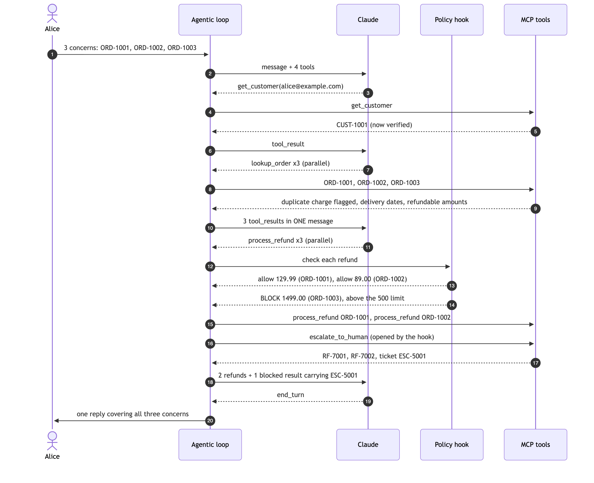

<details>
<summary>Diagram source (Mermaid)</summary>

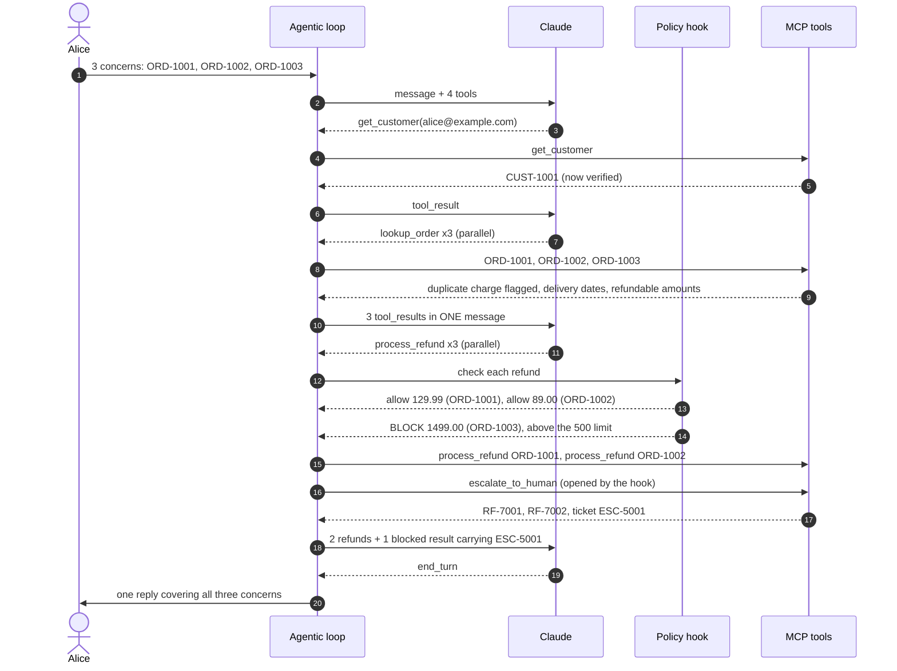

</details>

**What to look for in the trace:**
- An iteration with **three `lookup_order` calls together**: parallel investigation.
- Two `process_refund` calls marked `ok`, and one marked `BLOCKED by policy hook:
  permission/REFUND_REQUIRES_HUMAN_APPROVAL, auto-escalated as ESC-5001`.
- **No** separate `escalate_to_human` call from Claude for the laptop. The hook already opened
  the ticket, and the blocked result tells Claude not to open a duplicate.
- A reply that walks through the headphones, the coffee maker, and the laptop, with refund IDs
  and the ticket ID.

**Sample run** (2026-09-28, `claude-opus-5`; long arguments shortened with `...`):

```text
  . iteration 1: stop_reason=tool_use
  -> get_customer({"email": "alice@example.com"})  ok
  -> lookup_order({"order_id": "ORD-1001"})  ok
  -> lookup_order({"order_id": "ORD-1002"})  ok
  -> lookup_order({"order_id": "ORD-1003"})  ok
  . iteration 2: stop_reason=tool_use
  -> process_refund({"customer_id": "CUST-1001", "order_id": "ORD-1001", "amount": 129.99, "reason": "duplicate_charge"})  ok
  -> process_refund({"customer_id": "CUST-1001", "order_id": "ORD-1002", "amount": 89.0, "reason": "damaged_item"})  ok
  -> process_refund({"customer_id": "CUST-1001", "order_id": "ORD-1003", "amount": 1499.0, "reason": "changed_mind"})  BLOCKED by policy hook: permission/REFUND_REQUIRES_HUMAN_APPROVAL, auto-escalated as ESC-5001
  . iteration 3: stop_reason=end_turn
```

Claude ran the customer lookup and all three order lookups in **one parallel batch**, so the whole
turn took three iterations. That is a valid variation of the diagram above. From the reply:

> **3. Laptop return on ORD-1003**: Your return is within the window (it closes Oct 18), but a
> $1,499.00 refund is above the amount I can approve on my own, so it's gone to a specialist for
> approval as ticket ESC-5001.

**Graded checks:** refund processed for ORD-1001 · refund processed for ORD-1002 · no refund for
ORD-1003 · ORD-1003 escalated · the reply mentions each of the three concerns · the reply gives the
ticket ID · the run escalated (expected).

---

## Scenario 2: Duplicate charge

**What it shows:** the happy path. One concern, resolved on first contact, with no human involved.

```bash
uv run support-agent eval --scenario duplicate_charge
```

**Customer message:**

> Hi, it's alice@example.com. I see two charges of $129.99 for my headphones order ORD-1001. Can
> you fix that?

**Expected sequence:**

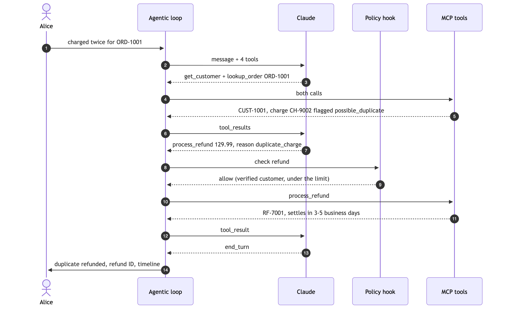

<details>
<summary>Diagram source (Mermaid)</summary>

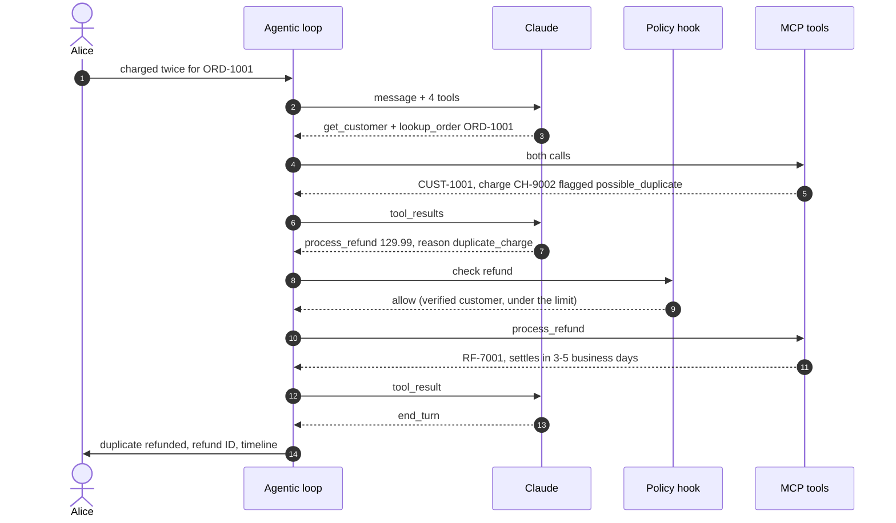

</details>

**What to look for in the trace:** `lookup_order` returns a charge flagged `possible_duplicate`,
then **one** `process_refund` for **$129.99**, the duplicate only, not the full $259.98 charged.
No escalation.

**Sample run** (2026-09-28, `claude-opus-5`; long arguments shortened with `...`):

```text
  . iteration 1: stop_reason=tool_use
  -> get_customer({"email": "alice@example.com"})  ok
  -> lookup_order({"order_id": "ORD-1001"})  ok
  . iteration 2: stop_reason=tool_use
  -> process_refund({"customer_id": "CUST-1001", "order_id": "ORD-1001", "amount": 129.99, "reason": "duplicate_charge"})  ok
  . iteration 3: stop_reason=end_turn
```

> I've refunded the extra $129.99 to your original payment method. Your refund reference is
> RF-7001, and it should settle within 3-5 business days. The remaining $129.99 is the correct
> charge for the headphones, so that one stays.

**Graded checks:** refund processed for ORD-1001 · resolved without escalation · the reply contains
the refund ID (`RF-...`) · the run did not escalate (expected).

---

## Scenario 3: Transient error, then a business error

**What it shows:** two error categories in one conversation. A **transient** error
(`isRetryable: true`) that Claude should retry, followed by a **business** outcome (the return
window has closed) that Claude should explain, not retry and not escalate.

```bash
uv run support-agent eval --scenario transient_then_business_error
```

**Customer message:**

> Hello, this is bob@example.com. The running shoes from order ORD-1004 don't fit. Can I get a
> refund?

**Expected sequence:**

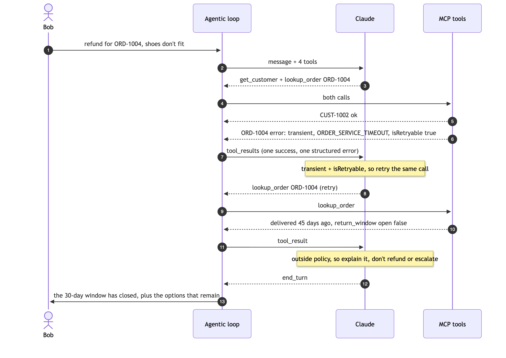

<details>
<summary>Diagram source (Mermaid)</summary>

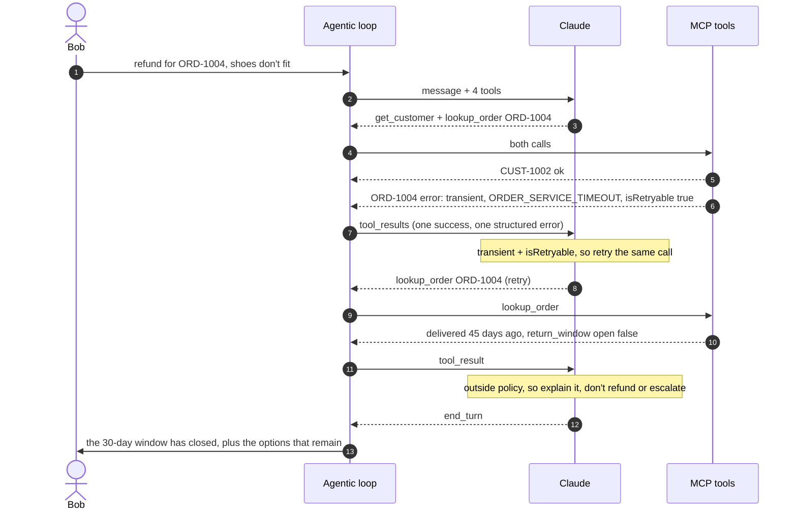

</details>

**What to look for in the trace:**
- `lookup_order ... error transient/ORDER_SERVICE_TIMEOUT (isRetryable=True)`, then the **same
  call again**, marked `ok`.
- Either no `process_refund` at all (Claude reads `return_window.open: false` and doesn't try),
  or one that returns `business/RETURN_WINDOW_EXPIRED` and is **not** retried. Both are correct.
- A reply that explains the 30-day policy in plain language, without error codes.

**Sample run** (2026-09-28, `claude-opus-5`; long arguments shortened with `...`):

```text
  . iteration 1: stop_reason=tool_use
  -> get_customer({"email": "bob@example.com"})  ok
  -> lookup_order({"order_id": "ORD-1004"})  error transient/ORDER_SERVICE_TIMEOUT (isRetryable=True)
  . iteration 2: stop_reason=tool_use
  -> lookup_order({"order_id": "ORD-1004"})  ok
  . iteration 3: stop_reason=end_turn
```

Claude read `return_window.open: false` and didn't attempt the refund. From the reply:

> The running shoes ($120.00) were delivered on August 14, 2026, and our 30-day return window for
> that order closed on September 13, 2026. [...] If you'd like, I can pass your case to a support
> specialist to review it as an exception.

**Graded checks:** `lookup_order` returned `ORDER_SERVICE_TIMEOUT` · `lookup_order` was retried
for ORD-1004 until it succeeded · no refund processed · resolved without escalation · the reply
mentions the 30-day window.

---

## Scenario 4: Validation error

**What it shows:** a **validation** error from bad input (a typo in the email). The agent must ask
the customer to confirm the email. It must not guess the customer, refund an order it can't tie to
a verified identity, or escalate.

This scenario is also why the policy has an identifier rule. In the first live evaluation, Claude
"fixed" the typo itself, looked up `alice@example.com`, and refunded Alice's order: anyone typing a
near-miss of her email could have done the same. The hook now blocks any `get_customer` lookup
whose email or customer ID doesn't appear in what the customer wrote.

```bash
uv run support-agent eval --scenario validation_error
```

**Customer message:**

> Hi, my email is alice@exmaple.com. My coffee maker order ORD-1002 arrived broken, please refund
> it.

**Expected sequence:**

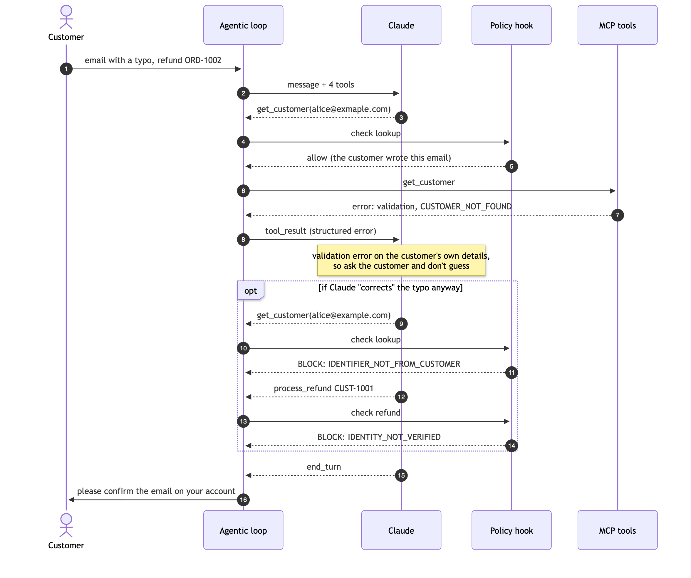

<details>
<summary>Diagram source (Mermaid)</summary>

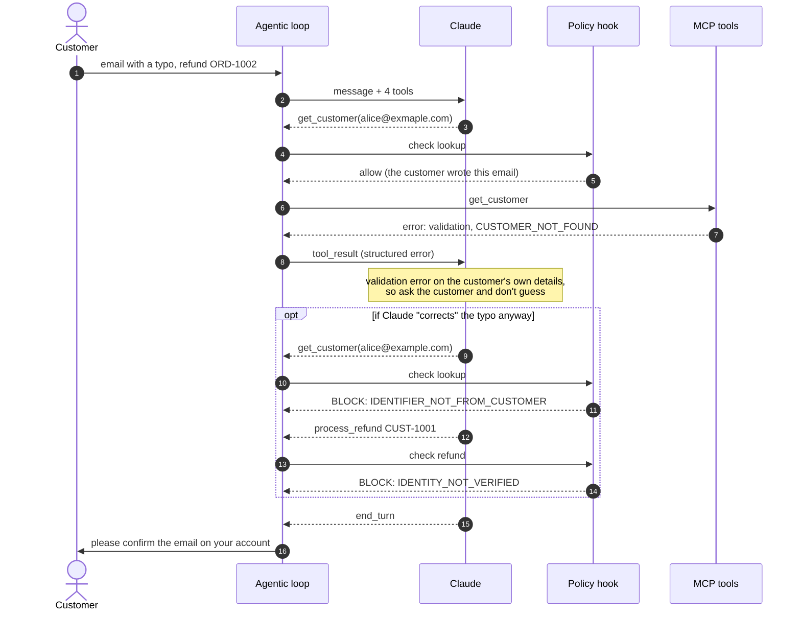

</details>

**What to look for in the trace:** `get_customer ... error validation/CUSTOMER_NOT_FOUND`, then a
reply that asks the customer to double-check the email. Claude may also look up ORD-1002. If it
tries a corrected email, you'll see `BLOCKED by policy hook: validation/IDENTIFIER_NOT_FROM_CUSTOMER`,
and any refund attempt is blocked with `IDENTITY_NOT_VERIFIED`. Either way, no money moves.

**Sample runs** (2026-09-28, `claude-opus-5`), before and after the fix:

```text
BEFORE: first live run, scenario FAILED
  . iteration 1: stop_reason=tool_use
  -> get_customer({"email": "alice@exmaple.com"})  error validation/CUSTOMER_NOT_FOUND (isRetryable=False)
  -> lookup_order({"order_id": "ORD-1002"})  ok
  . iteration 2: stop_reason=tool_use
  -> get_customer({"email": "alice@example.com"})  ok        <- Claude "corrected" the email itself
  . iteration 3: stop_reason=tool_use
  -> process_refund({"customer_id": "CUST-1001", "order_id": "ORD-1002", "amount": 89.0, "reason": "damaged_item"})  ok
  . iteration 4: stop_reason=end_turn                         <- $89 refunded to an unverified account
```

```text
AFTER: identifier rule in the hook, clarified prompt, scenario PASSED
  . iteration 1: stop_reason=tool_use
  -> get_customer({"email": "alice@exmaple.com"})  error validation/CUSTOMER_NOT_FOUND (isRetryable=False)
  -> lookup_order({"order_id": "ORD-1002"})  ok
  . iteration 2: stop_reason=end_turn
```

> One snag: I couldn't find an account under alice@exmaple.com, so I'm not able to verify the
> account and release the refund yet. Could you confirm the exact email address (or the customer
> ID) on your account? I don't want to guess and touch the wrong account.

After the fix the prompt alone was enough, so the hook never had to fire. The hook is still there
as the guarantee: if Claude tries the corrected email again, the lookup is blocked.

**Graded checks:** `get_customer` returned `CUSTOMER_NOT_FOUND` · no refund processed · resolved
without escalation · the reply mentions the email.

---

## Scenario 5: Permission error

**What it shows:** a **permission** error (`isRetryable: false`). Carol's account has a
trust-and-safety refund hold that her profile doesn't show. It only surfaces when a refund is
attempted. The agent must not retry. It must escalate and give Carol the ticket.

```bash
uv run support-agent eval --scenario permission_error
```

**Customer message:**

> Hi, I'm Carol, carol@example.com. The desk lamp from order ORD-1006 arrived broken. Please refund
> me.

**Expected sequence:**

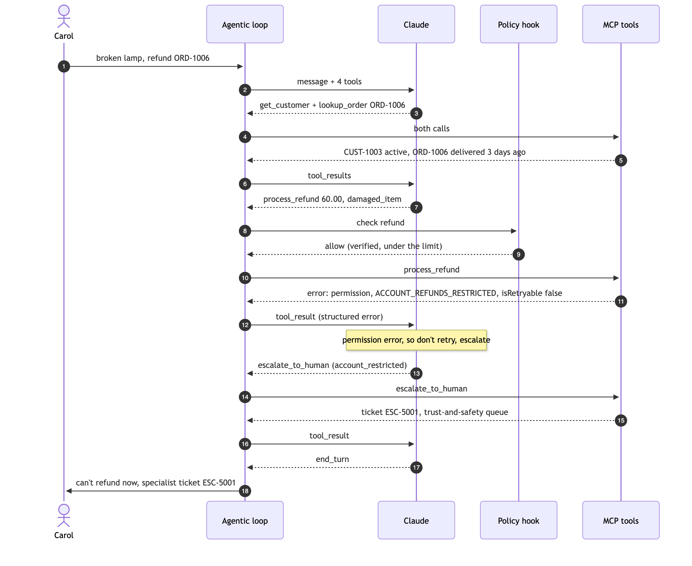

<details>
<summary>Diagram source (Mermaid)</summary>

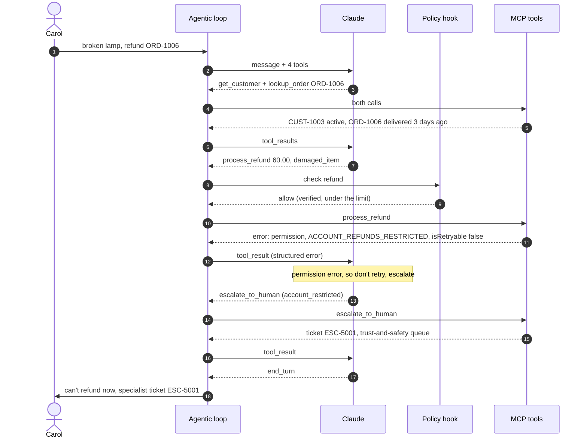

</details>

**What to look for in the trace:** `process_refund ... error permission/ACCOUNT_REFUNDS_RESTRICTED
(isRetryable=False)`, then **no second `process_refund`**, then an `escalate_to_human` call. Note
the difference from Scenario 1: here the *backend* refused (a permission error the agent has to
act on), whereas in Scenario 1 the *hook* refused and escalated automatically.

**Sample run** (2026-09-28, `claude-opus-5`; long arguments shortened with `...`):

```text
  . iteration 1: stop_reason=tool_use
  -> get_customer({"email": "carol@example.com"})  ok
  -> lookup_order({"order_id": "ORD-1006"})  ok
  . iteration 2: stop_reason=tool_use
  -> process_refund({"customer_id": "CUST-1003", "order_id": "ORD-1006", "amount": 60.0, "reason": "damaged_item"})  error permission/ACCOUNT_REFUNDS_RESTRICTED (isRetryable=False)
  . iteration 3: stop_reason=tool_use
  -> escalate_to_human({"reason_category": "account_restricted", "customer_id": "CUST-1003", "order_id": "ORD-1006", "summary": "Carol Smith (CUST-1003, ...) reports the Desk Lamp from order ORD-1006 arrived broken ...", "actions_taken": [...], "recommended_action": "Review the trust-and-safety hold and, if cleared, issue the $60.00 refund ...", "priority": "high"})  ok
  . iteration 4: stop_reason=end_turn
```

> I wasn't able to issue it myself: there's a review hold on refunds for your account right now,
> which I can't lift. I've passed your case to a specialist team [...] Your reference is ESC-5001,
> and you can expect a first response within 4 hours.

**Graded checks:** `process_refund` hit `ACCOUNT_REFUNDS_RESTRICTED` and was not retried · no
refund processed · escalated · the reply gives the ticket ID.

---

## Scenario 6: Explicit request for a human

**What it shows:** when a customer asks for a person, the agent escalates **immediately**, with a
self-contained summary, instead of trying to win them over.

```bash
uv run support-agent eval --scenario explicit_human_request
```

**Customer message:**

> I've contacted you three times about my orders and I'm done with bots. Get me a human manager
> now. My email is alice@example.com.

**Expected sequence:**

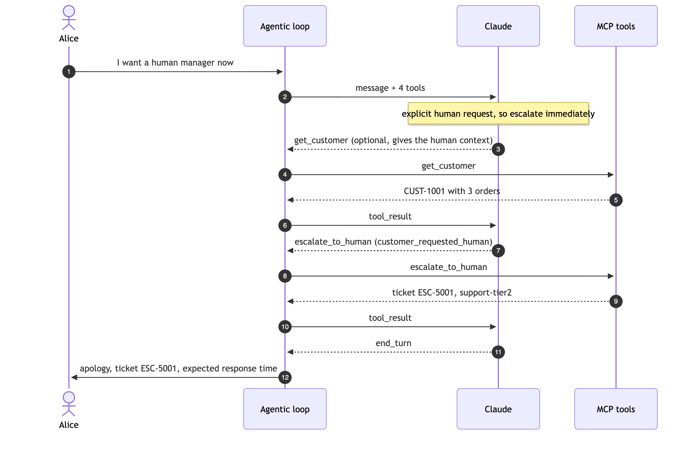

<details>
<summary>Diagram source (Mermaid)</summary>

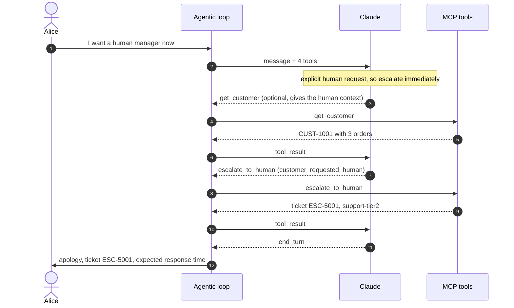

</details>

**What to look for in the trace:** an `escalate_to_human` call with
`"reason_category": "customer_requested_human"`. Look at its `summary`: it should make sense to a
human who never saw this conversation.

**Sample run** (2026-09-28, `claude-opus-5`; long arguments shortened with `...`):

```text
  . iteration 1: stop_reason=tool_use
  -> get_customer({"email": "alice@example.com"})  ok
  . iteration 2: stop_reason=tool_use
  -> escalate_to_human({"reason_category": "customer_requested_human", "summary": "Alice Nguyen (CUST-1001, ...) states she has contacted support three times already about her orders and is explicitly requesting a human manager ...", "customer_id": "CUST-1001", "actions_taken": [...], "recommended_action": "Have a senior/manager-level specialist contact Alice directly ...", "priority": "high"})  ok
  . iteration 3: stop_reason=end_turn
```

Claude verified Alice first so the ticket carries her account and orders, but it investigated
nothing else and issued no refunds, because she asked for a person.

**Graded checks:** escalated with reason `customer_requested_human` · the reply gives the ticket
ID.

---

## Scenario 7: Multi-concern with an out-of-scope request

**What it shows:** a message with one concern the agent can resolve (order status) and one it
can't (changing an address, which no tool supports). The agent answers the first and escalates
only the second, in one reply.

```bash
uv run support-agent eval --scenario multi_concern_out_of_scope
```

**Customer message:**

> bob@example.com here. Where is my rain jacket, order ORD-1005? Also, please change the shipping
> address on my account to 12 Oak Street, Springfield.

**Expected sequence:**

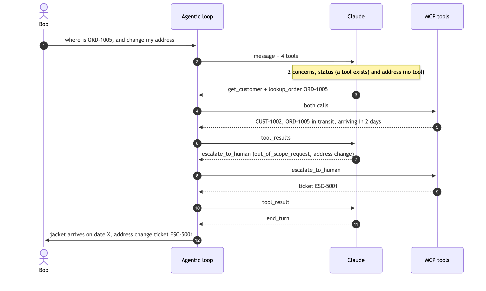

<details>
<summary>Diagram source (Mermaid)</summary>

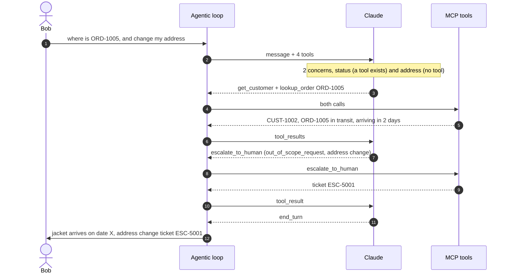

</details>

**What to look for in the trace:** a `lookup_order` for ORD-1005 marked `ok`, then an
`escalate_to_human` with `"reason_category": "out_of_scope_request"` about the address only. The
reply covers both concerns.

**Sample run** (2026-09-28, `claude-opus-5`; long arguments shortened with `...`):

```text
  . iteration 1: stop_reason=tool_use
  -> get_customer({"email": "bob@example.com"})  ok
  -> lookup_order({"order_id": "ORD-1005"})  ok
  . iteration 2: stop_reason=tool_use
  -> escalate_to_human({"reason_category": "out_of_scope_request", "summary": "Bob Martinez (CUST-1002, ...) asks to change the shipping address on his account to 12 Oak Street, Springfield. Agent tools cannot modify account addresses ...", "customer_id": "CUST-1002", "order_id": "ORD-1005", ...})  ok
  . iteration 3: stop_reason=end_turn
```

> **Rain jacket (ORD-1005):** Your order is in transit, with estimated delivery on September 30,
> 2026. [...] **Address change:** I'm not able to update the address on your account myself, so
> I've passed it to a specialist team [...] Your reference is **ESC-5001**.

**Graded checks:** no refund processed · escalated with reason `out_of_scope_request` · the reply
mentions the jacket order · the reply gives the ticket ID.

---

## Reading the summary

`uv run support-agent eval` ends with three numbers:

```text
=== Summary
  Scenarios passed:           7/7
  First-contact resolution:   3/3 (100%) of scenarios that should be resolved
  Escalation decisions right: 7/7
```

| Metric | Definition | Why it matters |
|---|---|---|
| **Scenarios passed** | Every check passed and the escalation decision was right | Overall correctness |
| **First-contact resolution** | Of the scenarios that *should* be resolved without a human (2, 3, 4), the share that were | The project target is 80% or more |
| **Escalation decisions right** | Runs that escalated exactly when they should have | Catches both kinds of mistake: escalating too much wastes human time, and escalating too little leaves customers stuck |

A failed check prints `[FAIL]` next to its description. The command exits with status 1 if any
scenario fails, so you can use it in CI.

---

## Experiments to try

Each experiment below changes one thing, so you can see a single mechanism at work.

**Make the hook fire on a small refund.** Lower the approval limit so that the $129.99
duplicate-charge refund is over it:

```bash
SUPPORT_AGENT_REFUND_LIMIT=100 uv run support-agent eval --scenario duplicate_charge
```

The refund is now `BLOCKED by policy hook` and auto-escalated. The scenario **fails** its
"resolved without escalation" check, which is correct: with that limit, the agent is no longer
allowed to resolve it alone.

**Push back after a policy decision.** Start a conversation and argue with the answer:

```bash
uv run support-agent chat
```

```text
you> Hi, bob@example.com. I want a refund for my running shoes, order ORD-1004.
you> That's not fair, I've been a customer for years. I want an exception.
```

After the second message, Claude should escalate with `policy_exception`: the customer is now
*asking* for an exception, which the first answer alone didn't warrant.

**Ask for something that isn't due yet.**

```bash
uv run support-agent ask "bob@example.com here. My rain jacket ORD-1005 never arrived, refund it please."
```

The order is still in transit, so the refund returns `business/ORDER_STILL_IN_TRANSIT` (or Claude
avoids it after reading the status) and the reply gives the estimated delivery date.

**Refund the same thing twice.** In `chat`, get the ORD-1002 refund processed, then ask for it
again. The second attempt returns `business/ALREADY_REFUNDED`.

**Run the Claude Agent SDK runtime.** Same tools, same policy, but the SDK drives the loop, and
the policy runs as a `PreToolUse` hook that returns `permissionDecision: "deny"`:

```bash
uv run support-agent ask --runtime sdk "Hi, alice@example.com. Please refund my laptop, ORD-1003, I changed my mind."
```

The SDK runs the loop itself, so its trace is shorter: it lists the tool calls Claude made, then
any hook denials. In a run on 2026-09-28:

```text
  -> get_customer({"email": "alice@example.com"})
  -> lookup_order({"order_id": "ORD-1003"})
  -> process_refund({"customer_id": "CUST-1001", "order_id": "ORD-1003", "amount": 1499, "reason": "changed_mind"})
  PreToolUse hook denied process_refund: permission/REFUND_REQUIRES_HUMAN_APPROVAL, auto-escalated as ESC-5001
```

**Talk to the tools directly.** Skip the agent and call the MCP server from Claude Code or the
MCP Inspector (see [Use the MCP server from other clients](README.md#use-the-mcp-server-from-other-clients)).
You'll see the raw structured errors. The policy hook won't apply, because it belongs to the
agent.

---

## Troubleshooting

| Symptom | Fix |
|---|---|
| `No Claude API credentials found` | Put `ANTHROPIC_API_KEY=...` in `.env` in the project folder (not in `.env.example`), or export it in your shell. |
| `Claude API error 401` | The key is invalid or revoked. Create a new one and update `.env`. |
| `Claude API error 429` | Rate limited. Wait and run again, or run one scenario at a time with `--scenario`. |
| A check fails on one run and passes on the next | Live runs vary. Re-run the scenario, and read the trace printed above the checks to see what Claude did differently. |
| With `--runtime sdk`: `claude.ai connectors are disabled because ANTHROPIC_API_KEY ... is set` | Harmless. The Claude Code CLI bundled with the Agent SDK prints this when an API key is set. The runtime doesn't use connectors. |
| `ModuleNotFoundError: support_agent` | Run commands with `uv run` from the project folder, after `uv sync`. |
